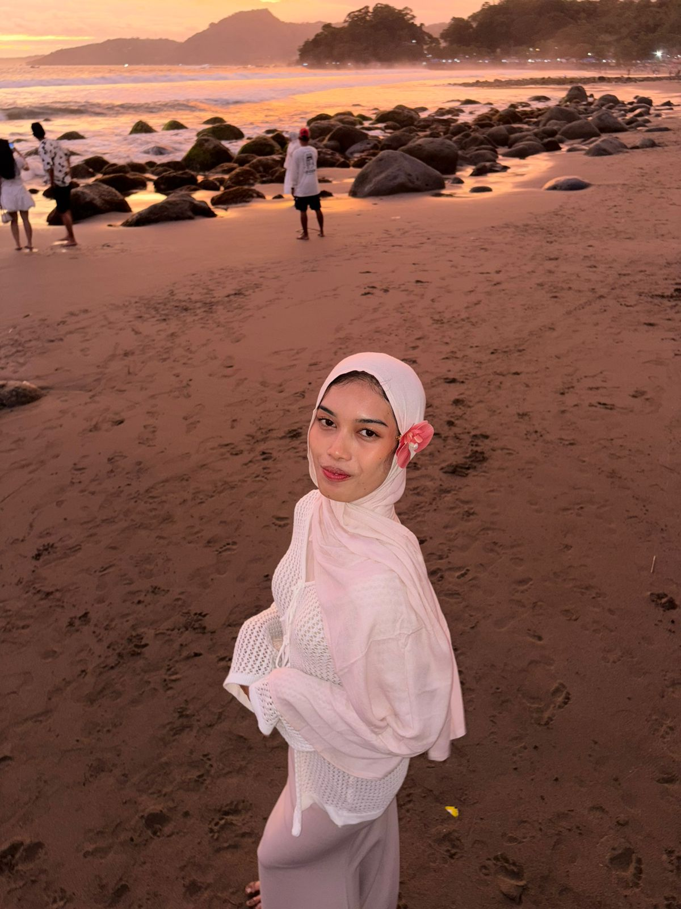

<!DOCTYPE html>
<html lang="id">
<head>
<meta charset="UTF-8">
<meta name="viewport" content="width=device-width, initial-scale=1.0">
<title>Portfolio Djulia</title>

</head>
<body>
<header>
<h2 class="logo">Djulia</h2><nav><a href="#">Home</a><a href="#">Tentang</a><a href="#">Skill</a><a href="#">Project</a><a href="#">Kontak</a></nav><button class="btn">Download CV</button>
</header>
<section class="hero">

<h3>Halo, Saya</h3><h1>Djulia</h1>
Mahasiswa Bisnis Digital | Kreatif | Analitis

Saya adalah mahasiswa Bisnis Digital yang tertarik pada dunia teknologi, digital marketing, dan pengembangan web.

<button class="btn">Hubungi Saya</button> <button class="btn-outline">Lihat Project</button>

</section>
<section class="about container">

<h2>Tentang Saya</h2>
Saya merupakan mahasiswa program studi Bisnis Digital yang memiliki minat besar dalam bidang teknologi, pemasaran digital, dan desain. Saya senang belajar hal baru dan bekerja dalam tim.

🎓 Mahasiswa Bisnis Digital

💡 Kreatif & Teknologi

🎯 Fokus Hasil

</section>
<section class="skills container"><h2>Skill</h2>

Digital Marketing

Database

Canva

Microsoft Office

</section>
<section class="project container"><h2>Project</h2>

<h3>Website Sederhana</h3>
Membuat website e-commerce sederhana menggunakan HTML dan CSS
<button class="btn-outline">Lihat Detail</button>

<h3>Desain Branding</h3>
Membuat desain logo dan konsep brand
<button class="btn-outline">Lihat Detail</button>

</section>
<section class="contact">

📧 julialia0912@email.com

📱 0881-0237-48746

📍 Indonesia

</section>
<footer>
© 2026 Julia Lia | All Rights Reserved
</footer>
</body></html>
